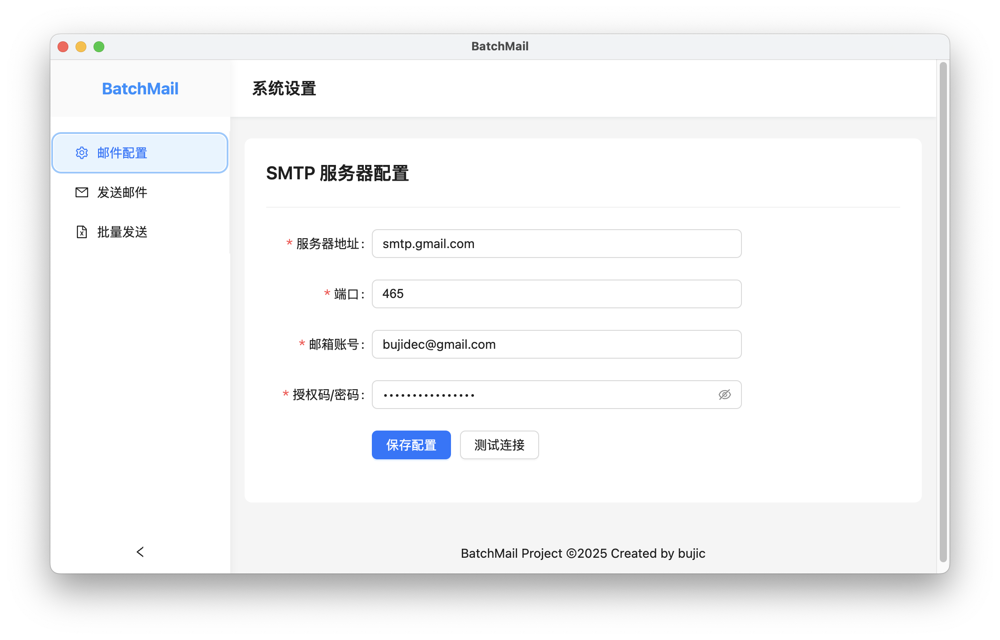
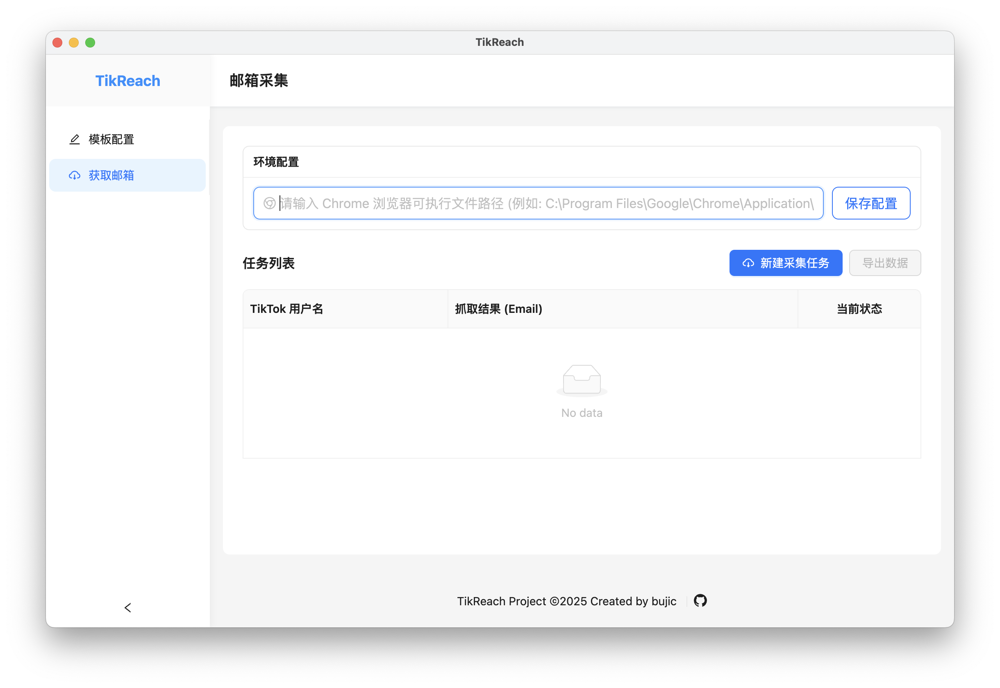

# TikReach - TikTok 邮箱采集与模板管理工具

TikReach 是一款基于 **Electron** + **Vue 3** + **TypeScript** 开发的现代化桌面应用。它专注于帮助用户批量采集 TikTok 用户的公开邮箱，并提供强大的邮件模板管理与导出功能。



## ✨ 主要特性

- **批量邮箱采集**：
  - 支持批量输入 TikTok 用户名。
  - 调用本地 Chrome 浏览器（Puppeteer）自动访问主页抓取公开邮箱。
  - 实时显示采集进度与状态（成功/失败/进行中）。
- **邮件模板管理**：
  - 内置 **Markdown** 编辑器 (Vditor)，所见即所得。
  - 支持配置邮件主题 (Subject) 与正文 (Body)。
  - 支持变量替换（如 `{{username}}` 自动替换为目标用户名）。
- **数据导出**：
  - 将采集成功的邮箱数据导出为 Excel (`.xlsx`) 文件。
  - 导出文件自动包含预设的邮件主题与渲染后的 HTML 正文，方便对接其他邮件发送工具。
- **现代化 UI**：基于 Ant Design Vue 开发，界面简洁美观。
- **跨平台**：支持 Windows, macOS 和 Linux。

## 🛠️ 技术栈

- **Core**: [Electron](https://www.electronjs.org/)
- **Frontend**: [Vue 3](https://vuejs.org/) + [TypeScript](https://www.typescriptlang.org/) + [Vite](https://vitejs.dev/)
- **UI Framework**: [Ant Design Vue](https://www.antdv.com/)
- **Automation**: [Puppeteer Core](https://pptr.dev/)
- **Editor**: [Vditor](https://b3log.org/vditor/)

## 🚀 快速开始

### 1. 环境准备

确保您的电脑上已安装 [Node.js](https://nodejs.org/) (推荐 v16+) 和 [Yarn](https://yarnpkg.com/)。

### 2. 克隆项目

```bash
git clone https://github.com/chao-eng/batch-mail.git
cd batch-mail
```

### 3. 安装依赖

```bash
yarn install
```

> 国内用户建议配置 Yarn 淘宝源以加速下载。

### 4. 启动开发环境

```bash
yarn run dev
```

启动后，应用将以开发模式运行，支持热重载。

## 📖 使用指南

1.  **环境配置**：
    *   首次使用请进入“获取邮箱”页面，配置您的本地 Chrome 浏览器路径（例如：`C:\Program Files\Google\Chrome\Application\chrome.exe` 或 macOS `/Applications/Google Chrome.app/Contents/MacOS/Google Chrome`）。
    *   点击“保存配置”。

2.  **配置邮件模板**：
    *   进入“模板配置”页面。
    *   输入邮件主题。
    *   在编辑器中编写邮件正文，支持 Markdown 语法。使用 `{{username}}` 作为变量，导出时会自动替换为对应的 TikTok 用户名。
    *   点击“保存模板”。

3.  **执行采集任务**：
    *   进入“获取邮箱”页面，点击“新建采集任务”。
    *   批量粘贴目标 TikTok 用户名（每行一个）。
    *   点击“开始采集”，系统将自动启动浏览器进行抓取。

4.  **导出数据**：
    *   采集完成后，点击“导出数据”。
    *   系统将生成包含“用户邮箱”、“邮件主题”、“邮件正文(HTML)”的 Excel 文件。

## 📦 打包构建

本项目使用 Electron Forge 进行打包。

```bash
# 构建当前平台的应用
yarn run build

# 构建 Windows 平台应用
yarn run build:win32  # 32位
yarn run build:win64  # 64位

# 构建 macOS 应用
yarn run build:mac

# 构建 Linux 应用
yarn run build:linux

# 生成 Windows 安装包 (NSIS)
# 需确保 setup/NSIS 环境已配置
yarn run build:nsis-win32
yarn run build:nsis-win64
```

构建产物将位于 `out` 目录下。

## ⚠️ macOS 用户安装必读 / Note for macOS Users

由于本项目是开源项目，未购买 Apple 开发者签名，安装后可能会提示“应用已损坏”或“无法验证开发者”。请按以下步骤操作：

安装后，打开“终端 (Terminal)”。

输入以下命令并回车（可能需要输入密码）： 
```shell
sudo xattr -rd com.apple.quarantine /Applications/你的应用名.app
```

现在可以正常打开应用了。

## 📄 许可证

[MIT License](LICENSE)